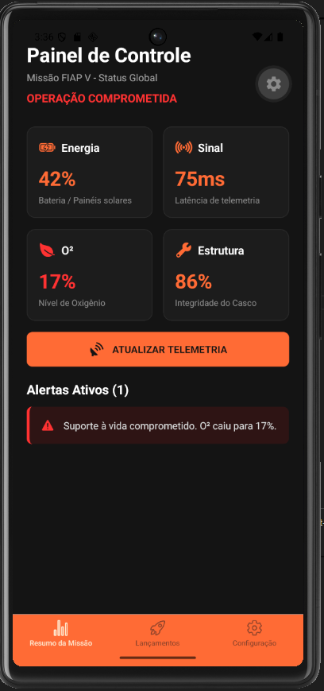
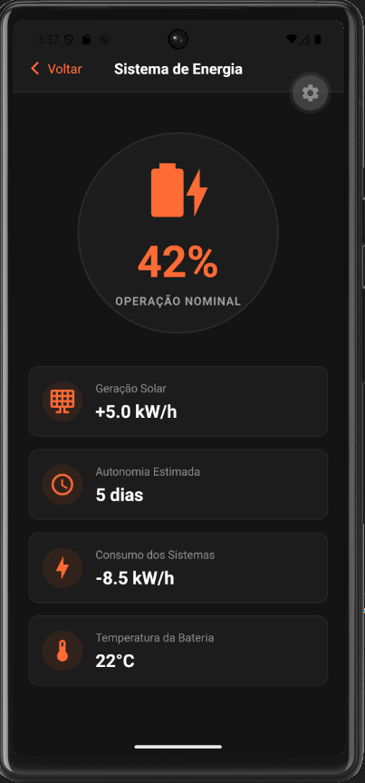
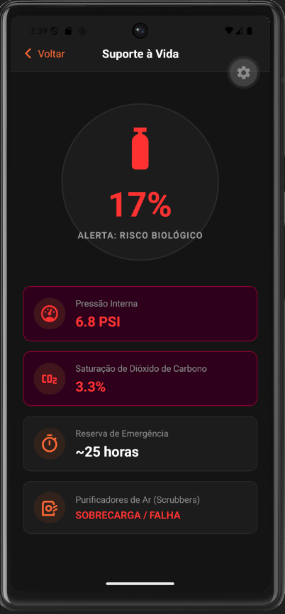
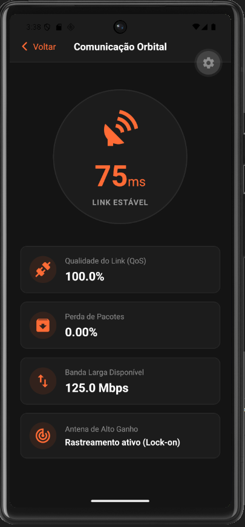
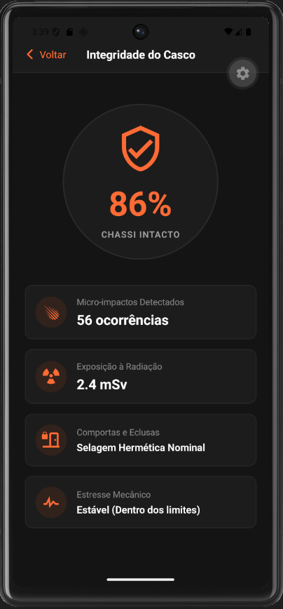
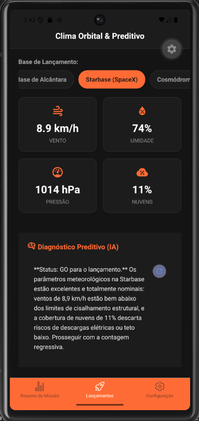
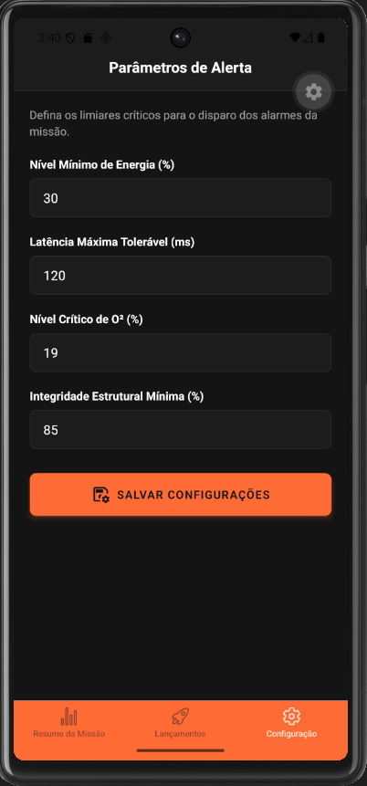

# Home do Projeto
### Global Solution 2026.1 - Space Predictive Analytics | FIAP

<br>

## Descrição
O **Space Predictive Analytics** é uma plataforma inteligente e responsiva desenvolvida para monitorar sistemas espaciais e operações orbitais simuladas. A solução coleta, processa e exibe dados críticos de sensores da nave, cobrindo painéis de energia, oxigênio, telemetria e integridade estrutural. O grande diferencial desta aplicação é a geração autônoma de alertas baseada em limiares configuráveis e um módulo de análise preditiva alimentado por IA Generativa para auxiliar a tomada de decisão em janelas de lançamento.

## Equipe
| Nome Completo | RM |
| :--- | :--- |
| Eduardo Abreu | RM 566460 |
| Gabriel dos Anjos | RM 565532|
| João Pedro de Souza | RM 563869 |

## Telas do Aplicativo

### Home (Dashboard Principal)
<br>
Visão geral da missão FIAP V com status global, resumo dos 4 sistemas vitais (Energia, Sinal, O², Estrutura) e alertas críticos em tempo real.

### Dashboard de Energia
<br>
Monitoramento detalhado da geração solar, autonomia estimada e consumo dos sistemas, alertando sobre a temperatura da bateria.

### Dashboard de Oxigênio (Suporte à Vida)
<br>
Indicadores de pressão interna da cabine, saturação de CO2, status dos filtros purificadores e reserva de emergência.

### Dashboard de Sinal (Comunicação)

Status da antena de alto ganho, latência de telemetria, perda de pacotes e qualidade do link.

### Dashboard de Integridade da Estrutura
<br>
Rastreio de micro-impactos no casco, exposição à radiação espacial e status de selagem das comportas e eclusas.

### Clima e Lançamentos (IA Preditiva)
<br>
Leitura climática em tempo real das bases de lançamento (via OpenWeather) combinada com um diagnóstico de risco automatizado por Inteligência Artificial (Gemini).

### Configurações de Alertas
<br>
Formulário com validação para calibração dos limiares de segurança da missão, com persistência local de dados.

## Funcionalidades
- [x] Dashboards dinâmicos com telemetria simulada e indicadores visuais de estado.
- [x] Roteamento estruturado em abas e pilhas utilizando `Expo Router`.
- [x] Gerenciamento de estado global da missão e parâmetros de segurança via `Context API`.
- [x] Persistência local das configurações de limiares utilizando `AsyncStorage`.
- [x] Sistema reativo de alertas que classifica automaticamente os avisos de acordo com a criticidade.
- [x] Formulários controlados com validação de tipagem e feedback visual de erro.
- [x] **Diferencial:** Integração com APIs externas (OpenWeather) para captação de dados climáticos reais das bases.
- [x] **Diferencial:** Implementação de IA Generativa (Google Gemini) para emissão de diagnósticos preditivos de lançamento.


## Tecnologias Utilizadas
- **Framework:** React Native + Expo
- **Navegação:** Expo Router
- **Estado e Armazenamento:** Context API, AsyncStorage
- **Ícones e Estilização:** @expo/vector-icons (Ionicons, MaterialCommunityIcons), StyleSheet
- **APIs Externas:** OpenWeather API, Google Gemini API (AI Studio)

## Como Executar o Projeto

### Pré-requisitos
- Node.js instalado em sua máquina.
- Expo CLI instalado globalmente (`npm install -g expo-cli`).
- Aplicativo Expo Go instalado no seu dispositivo móvel (iOS ou Android) ou um emulador configurado.

### Instalação e Execução
1. Clone o repositório para a sua máquina:
```bash
git clone https://github.com/EduardoAbreu01/gs-cross.git
```
2. Instale as dependências necessárias:
```bash
npm install --legacy-peer-deps
```
3. Crie um arquivo `.env` na raiz do projeto contendo as chaves de API necessárias:
```env
EXPO_PUBLIC_OPENWEATHER_API_KEY=sua_chave_aqui
EXPO_PUBLIC_GEMINI_API_KEY=sua_chave_aqui
```
4. Inicie o servidor de desenvolvimento:
```bash
npm run android
```
6. Escaneie o QR Code gerado no terminal utilizando o aplicativo Expo Go no seu smartphone ou pressione `a` para abrir no emulador Android / `i` para abrir no emulador iOS.

## Vídeo de Demonstração
[Clique aqui para assistir à demonstração da aplicação (YouTube) ](https://youtube.com/...)

## Licença
Este projeto foi desenvolvido para fins acadêmicos - FIAP 2026.
```
